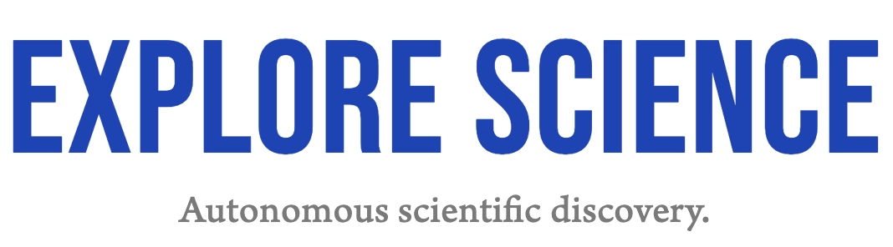

## Overview

At [*Explore Science*](htttps://explorescience.ai), our vision is to contribute to, and accelerate, humankind’s collective knowledge through the facilitation of **autonomous scientific discovery**.

This repository contains key study files for some of the world's first fully autonomous scientific research **in the real world** conducted by our **embodied AI system**.

By **open-sourcing** the pre-registration plans, data analysis code scripts, and data analysis outputs produced during our systems' investigations, we hope to facilitate **independent evaluation** of the contributions of AI frameworks to scientific discovery.

> *"Autonomously conducting entire scientific workflows end-to-end, from hypothesis to manuscript."*

## 🔍 Repository Structure

The `raw_data.zip` file contains all raw data collected in the VWM experiment.

Each study folder contains key documents produced by the system during the scientific workflow:

1. **Preregistration Document**: Outlines the hypothesis, methodology, and planned analyses before data collection began
2. **Analysis Scripts**: Code scripts written and executed by the system to process and analyze the collected data
3. **Analysis Outputs**: Results and visualizations produced by executing the code scripts

The full paper of each study is also available on our [website](https://explorescience.ai).

## About the Embodied AI Scientist

The Embodied AI Scientist system has been built to operate both collaboratively with scientists to expedite their workflows, as well as fully autonomously. The system completes:

- 💡 Hypothesis formulation
- 📝 Study design, incl. power analyses and pre-registration of methodologies
- ⏳ Data collection
- ✨ Data analysis
- 📊 Visualisation of results
- 🔮 Interpretation of findings
- 🎓 Scientific reporting

See our [blog](https://explorescience.ai/blog/embodied-ai-scientist) for details, with the full technical report coming soon.

## 📜 License

This repository and its contents are licensed under the [GNU Affero General Public License v3.0](LICENSE).

## 🔗 Contributing and Contact

If you're interested in collaborations, have questions, or want to share your thoughts, you can learn more at [explorescience.ai](https://explorescience.ai), join the conversation on X [@ExScienceAI](https://x.com/ExScienceAI), or send us an email at hello@explorescience.ai.

---

<i>Explore Science - Autonomous scientific discovery.</i>

